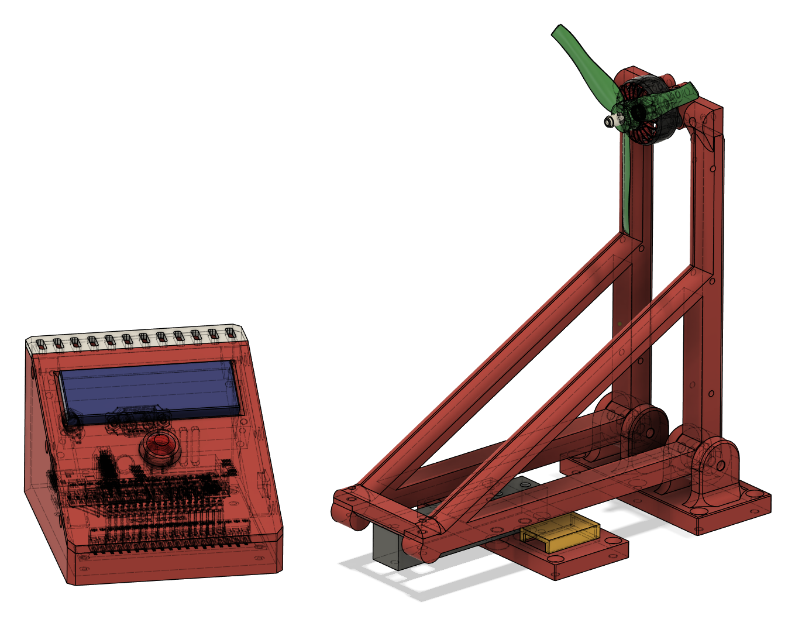
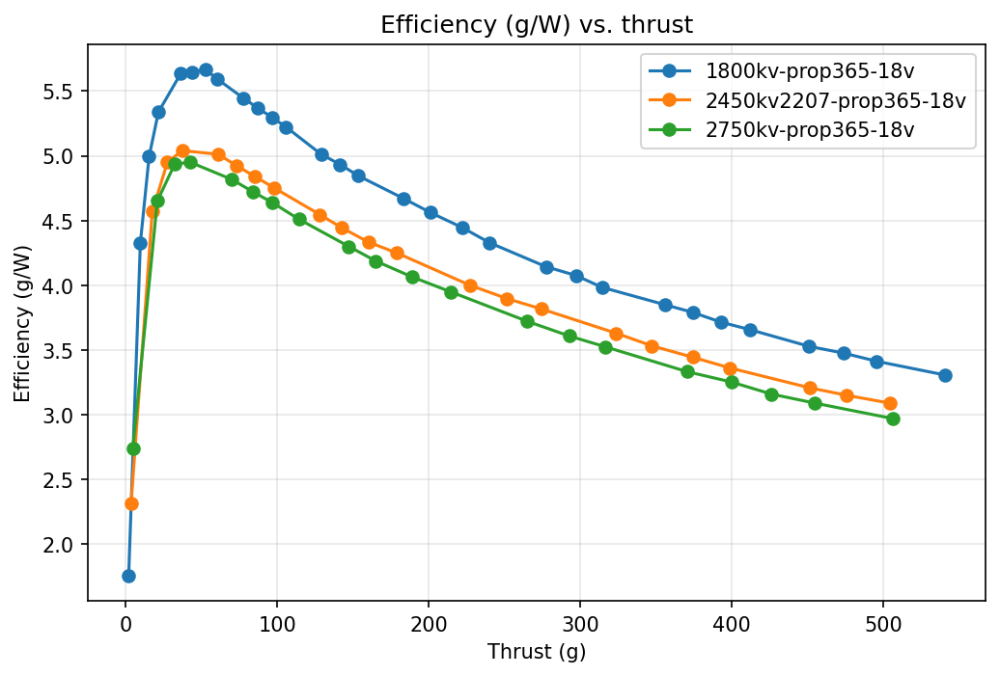
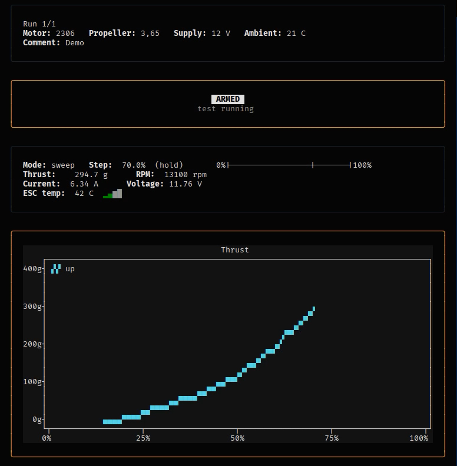
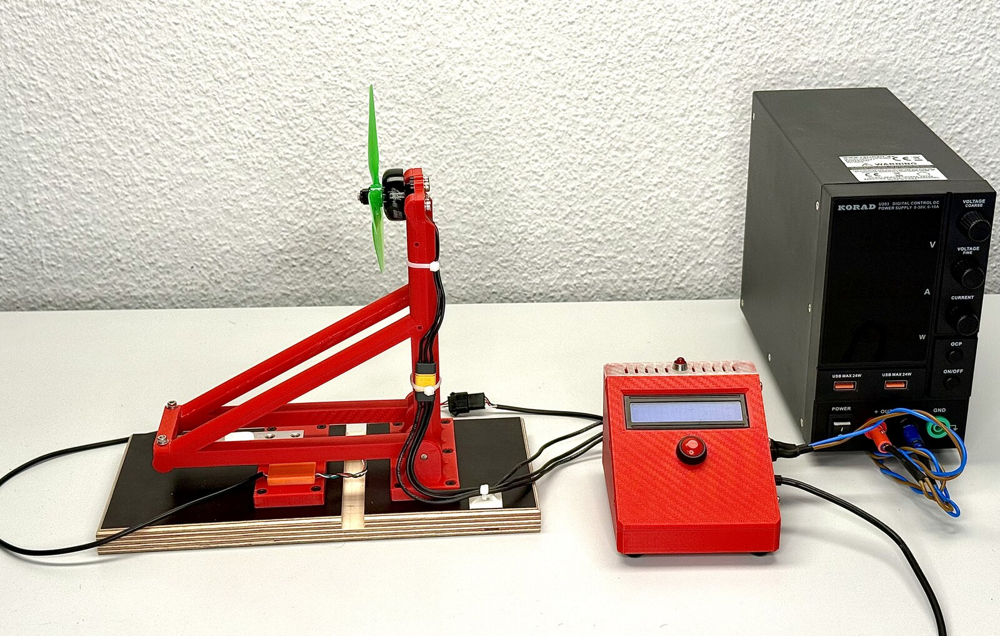
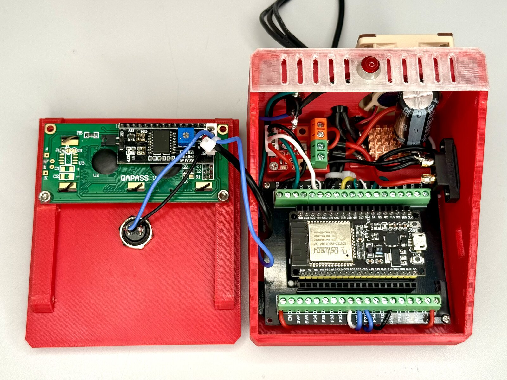

# Testbench – motor and propeller test stand

A test stand to measure small brushless motors with propellers: **thrust,
current, voltage, RPM and ESC temperature**. It runs on a lab power supply.

The main goal is not the most precise number. The goal is a measurement
process that is **traceable, reproducible and honest about its errors**:
every result file says where it comes from, raw data is never changed, and
every point that looks wrong is marked, not deleted.





*Efficiency (g/W) over thrust for three motors with the same propeller at
18 V. Each curve is the combination of two repeated runs.*

## How it works

```
ESP32 firmware  ->  Acquisition  ->  Analysis  ->  Comparison  ->  Plots
 raw ADC counts      RAW.csv        ANALYZED.csv   COMPARISON.csv   *.png
```

- The **firmware** (ESP32, C++, PlatformIO) reads the load cell (HX711), the
  current/voltage sensor (INA226) and the ESC telemetry. It sends only raw
  values with a timestamp per sample. It drives the throttle sequence by
  itself: up to full throttle in 2.5 % steps and down again.
- The **host software** (Python) records the data, makes one measurement point
  per throttle stage, checks each point against rules (VALID / WARNING /
  INVALID), compares repeated runs and draws plots.
- Calibration happens on the host. So old data can be recalculated when the
  calibration changes.

Details and reasons for each decision: [docs/ARCHITECTURE.md](docs/ARCHITECTURE.md).



*Live view of `testbench.py session` during a sweep (2306 motor, 12 V, 70 % throttle).*

## Validation

Before the main series, the measurement chain was checked in six steps
(details in [docs/DEVLOG.md](docs/DEVLOG.md)):

| Check | Result |
|---|---|
| Load cell calibration (5 weights) | residuals 0.6–2.5 % |
| Zero drift at rest | < 0.15 g in a typical 5 min run |
| Interference from motor and vibration | 0.0 g with decoupled load cell |
| INA226 vs. multimeter | voltage < 0.3 %, current 1.5–1.7 % |
| Settle time per stage | max 924 ms measured → 1000 ms used |
| Repeatability | SD < 1.2 % for thrust, current and RPM |

## Usage

Python 3.10 or newer.

```bash
pip install pyserial numpy pandas matplotlib rich textual textual-plotext
```

### Measuring with the test stand

The ESP32 is connected via USB (default port `/dev/ttyUSB0`, change with
`--port`). The run itself is started on the device with the arm button.

```bash
# Guided session: short setup questions, live view during the run,
# results and plots after the last repetition
python testbench.py session

# Or only record RAW files, without questions
python testbench.py record

# Load cell calibration with reference weights
python testbench.py calibrate
```

### Evaluating data

Every stage can also be started alone, for example to analyze old RAW files
again with a changed `validation.json`:

```bash
python testbench.py analyze data/raw/Hauptmessreihe/2026-09-17_13-58-33_sweep_1of2_RAW.csv
python testbench.py compare --label <name> <ANALYZED file> <ANALYZED file> ...
python testbench.py plot --kind g_per_w_vs_thrust <COMPARISON file> ...
```

Run `python testbench.py <command> --help` for all options.

### Development

- Firmware: `cd firmware && pio run`
- Tests: `python -m pytest`
- `record` and `session` accept `--simulate`. A built-in simulator then
  replaces the device, so the software can be tested without the test stand.
  The simulated values are not real measurements.

## Repository structure

| Path | Content |
|---|---|
| `firmware/` | ESP32 firmware: HX711 driver, INA226, ESC control and telemetry, serial protocol |
| `acquisition/` | Serial link (with simulator), recorder, guided session, calibration |
| `analysis/` | RAW → ANALYZED: measurement points, statistics, validation rules |
| `comparison/` | Run-to-run comparison and plots |
| `core/` | File names, CSV headers, units, calibration |
| `config/` | `calibration.json` (load cell fit), `validation.json` (all thresholds, each with its source) |
| `data/` | Real measurement data, see [data/README.md](data/README.md) |
| `tests/` | Automated tests (pytest) |
| `docs/` | Architecture and development log |

## Hardware



*Load cell rig with motor and propeller (left), controller box (middle),
lab power supply (right).*



*Inside the controller box: ESP32 on a screw terminal board, current sensor
and ESC with active cooling. Display and arm button in the lid.*

ESP32 WROOM-32, 2 kg load cell with HX711, INA226 current sensor
(0.002 Ω shunt), T-Hobby F35A ESC (AM32 firmware), lab power supply 10 A.
Frame and housing are 3D printed. Full list and pin assignment in
[docs/ARCHITECTURE.md](docs/ARCHITECTURE.md#hardware).

## Development with AI support

The firmware and the Python tools were implemented with the help of Claude
Code. I defined the test concept, requirements, test logic, interfaces and
validation strategy myself. The resulting measurement chain was then checked
with independent measuring equipment.
